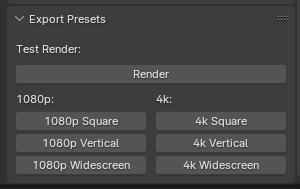

# Render Buddy

Provides output presets for rendering (like 1080p square, or 4k widescreen), and other helpful rendering utilities.

## Features

- Output presets
  - 1080p
  - 4k
- Test Render (preserves previous settings - renders at set percent)

## Getting Started

1. Download the plugin script (`plugin.py`).
1. Go to Blender preferences and install it as an addon.

## Development

1. Clone repo: `git clone git@github.com:whoisryosuke/blender-render-buddy.git`
1. Open Blender and go to the Scripting tab.
1. Click New button and make a new script.
1. Copy the contents of `plugin.py` and paste into the editor.
1. Run the plugin.
1. Rinse repeat.

> You can also just install it and then edit from where it's installed. Not sure if it hot reloads though, you might need to toggle plugin on/off.
